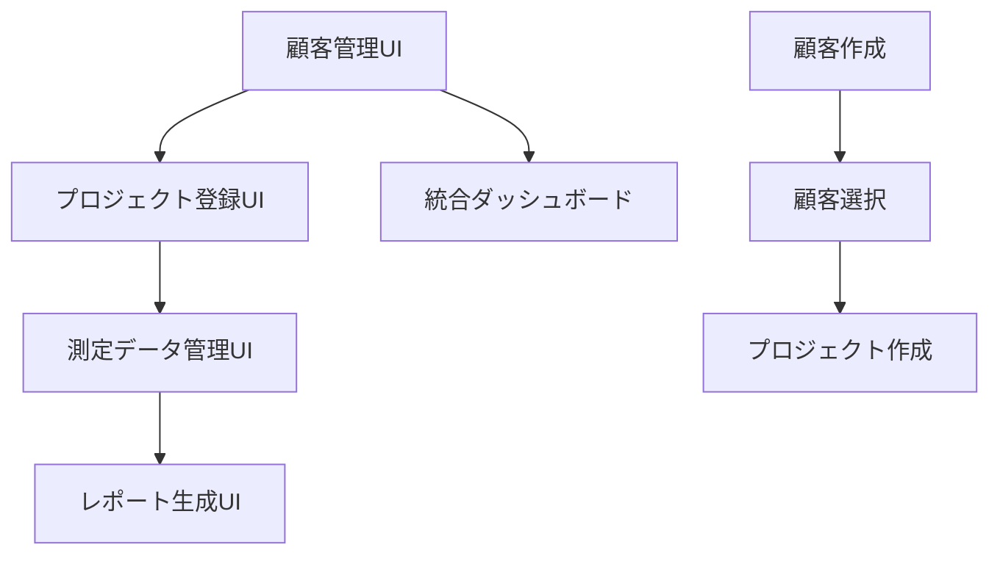

# PHASE 6: フロントエンド復元・顧客管理UI実装

## 🎯 Phase 6 概要

**期間**: 2025年7月28日〜 (予定2-3週間)  
**担当**: Claude Code (UI実装・統合開発)  
**前提条件**: Phase 5完了 (AI駆動次世代プラットフォーム完成)

## 📋 Phase 6 背景・必要性

### 🚨 **重要な課題発見**
Phase 5完了時に`test/`フォルダが完全削除されたため、以下の機能が利用不可能な状況:
- ✅ **バックエンドAPI**: 完全稼働中 (26エンドポイント)
- ❌ **フロントエンドUI**: 完全削除済み
- ❌ **顧客管理画面**: 存在しない
- ❌ **プロジェクト登録画面**: 存在しない

### 🔗 **依存関係の明確化**


**プロジェクト登録の前提条件**: 顧客管理機能が**絶対的に必要**
- プロジェクト作成API: `customerRepository.findById(projectData.customerId)` で顧客存在確認必須
- 顧客が存在しないとプロジェクト作成不可: `400 Bad Request: Customer not found`

## 🎯 Phase 6 実装目標

### ✅ **Phase 6.1: 基盤復元 (Week 1)**
1. **Next.js プロジェクト再構築**
   - package.json, tsconfig.json, tailwind.config.js
   - 基本レイアウト・認証システム復元
   - API Client復元・型定義整備

2. **認証・ナビゲーション**
   - AWS Cognito統合復元
   - ヘッダー・サイドバーコンポーネント
   - 保護されたルート実装

### ✅ **Phase 6.2: 顧客管理UI実装 (Week 1-2)**
1. **顧客一覧画面** (`/customers`)
   - カード形式レスポンシブ表示
   - 検索・フィルタリング (会社名、業界、ステータス)
   - ページネーション (nextToken方式)
   - 新規作成ボタン

2. **顧客作成フォーム** (`/customers/new`)
   - 会社名、連絡先情報、業界選択
   - バリデーション・エラーハンドリング
   - API統合・成功通知

3. **顧客詳細画面** (`/customers/[id]`)
   - 基本情報表示・編集機能
   - 関連プロジェクト一覧
   - プロジェクト作成への導線

### ✅ **Phase 6.3: プロジェクト管理UI実装 (Week 2-3)**
1. **プロジェクト一覧画面** (`/projects`)
   - プロジェクトカード表示
   - ステータス・顧客フィルタ
   - 検索・ソート機能

2. **プロジェクト作成フォーム** (`/projects/new`)
   - **顧客選択ドロップダウン** (API連携)
   - サイト位置入力 (地図統合)
   - 予算・CO2目標設定
   - 期間設定・バリデーション

3. **プロジェクト詳細画面** (`/projects/[id]`)
   - プロジェクト情報表示・編集
   - ステータス遷移管理
   - 測定データ・レポートへの導線

## 🛠 Phase 6 技術仕様

### フロントエンド技術スタック
```typescript
// 技術構成
- Next.js 14 (App Router)
- TypeScript 100%
- Tailwind CSS
- React Hook Form
- Zustand (状態管理)
- AWS Cognito (認証)
```

### API統合仕様
```typescript
// 顧客管理API統合
interface CustomerApiClient {
  getCustomers(query?: CustomerQuery): Promise<CustomerListResponse>;
  getCustomer(id: string): Promise<Customer>;
  createCustomer(data: CreateCustomerRequest): Promise<Customer>;
  updateCustomer(id: string, data: UpdateCustomerRequest): Promise<Customer>;
  deleteCustomer(id: string): Promise<void>;
}

// プロジェクト管理API統合  
interface ProjectApiClient {
  getProjects(query?: ProjectQuery): Promise<ProjectListResponse>;
  getProject(id: string): Promise<Project>;
  createProject(data: CreateProjectRequest): Promise<Project>;
  updateProject(id: string, data: UpdateProjectRequest): Promise<Project>;
  deleteProject(id: string): Promise<void>;
}
```

### ユーザーフロー設計
```
1. ログイン → ダッシュボード
2. 顧客管理 → 顧客一覧 → 顧客作成
3. 顧客詳細 → プロジェクト作成ボタン
4. プロジェクト作成 → 顧客選択 → 詳細入力
5. プロジェクト一覧 → プロジェクト詳細
```

## 📊 Phase 6 成果物・完了基準

### 🎯 **実装完了基準**
- ✅ 顧客CRUD操作が完全動作
- ✅ プロジェクトCRUD操作が完全動作  
- ✅ 顧客→プロジェクト連携が正常動作
- ✅ 認証・権限制御が正常動作
- ✅ レスポンシブデザイン対応完了
- ✅ TypeScriptエラー0件達成

### 📁 **成果物ファイル構成**
```
test/                           # Next.jsプロジェクト復元
├── app/
│   ├── page.tsx               # メインダッシュボード
│   ├── customers/
│   │   ├── page.tsx           # 顧客一覧
│   │   ├── new/page.tsx       # 顧客作成  
│   │   └── [id]/page.tsx      # 顧客詳細
│   ├── projects/
│   │   ├── page.tsx           # プロジェクト一覧
│   │   ├── new/page.tsx       # プロジェクト作成
│   │   └── [id]/page.tsx      # プロジェクト詳細
│   └── auth/                  # 認証ページ
├── components/
│   ├── ui/                    # UIコンポーネント
│   ├── forms/                 # フォームコンポーネント
│   └── layout/                # レイアウトコンポーネント
├── lib/
│   ├── api-client.ts          # API統合クライアント
│   ├── auth.ts                # 認証ロジック
│   └── stores/                # 状態管理
└── types/                     # TypeScript型定義
```

## 🚀 Phase 6 → Phase 7 引き継ぎ予定

### Phase 7 推奨内容
1. **測定データ管理UI復元**
2. **レポート生成UI復元**  
3. **高度分析ダッシュボード復元**
4. **モバイル対応・PWA化**

## 📝 Phase 6 開発ノート

### 重要な設計原則
1. **顧客ファースト**: 顧客管理を完璧に仕上げてからプロジェクト機能実装
2. **API駆動開発**: 既存26エンドポイントの完全活用
3. **型安全性**: TypeScript 100%、エラー0件維持
4. **ユーザビリティ**: 直感的で効率的なワークフロー設計

### 開発効率化戦略
- **段階的実装**: 顧客管理 → プロジェクト管理の順序厳守
- **コンポーネント再利用**: UIライブラリの統一設計
- **API統合パターン**: 一貫したエラーハンドリング・ローディング状態管理

---

**Phase 6開始日**: 2025年7月28日  
**Phase 6担当**: Claude Code  
**Phase 6目標**: 顧客・プロジェクト管理UI完全復元・新規プロジェクト登録機能実現